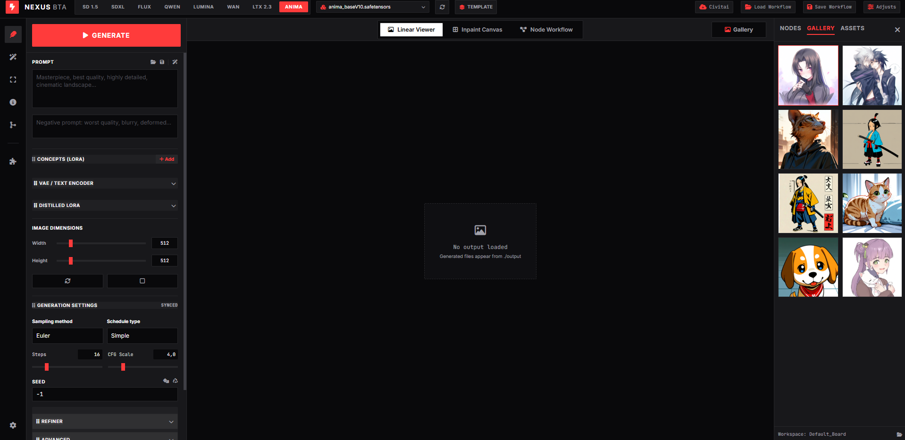
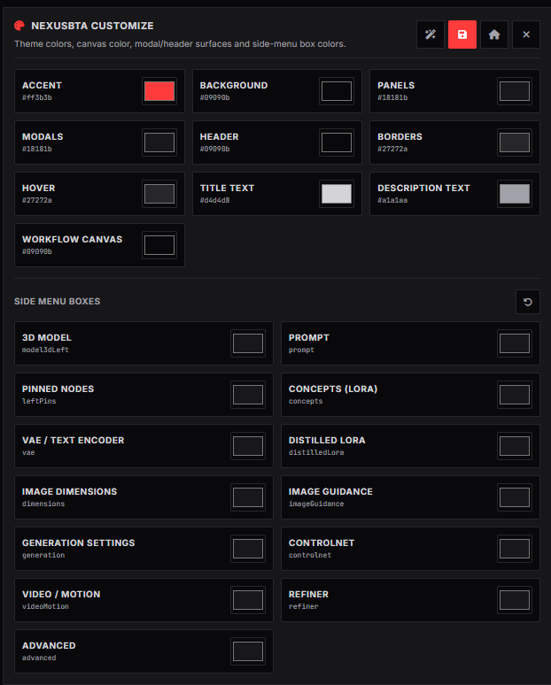
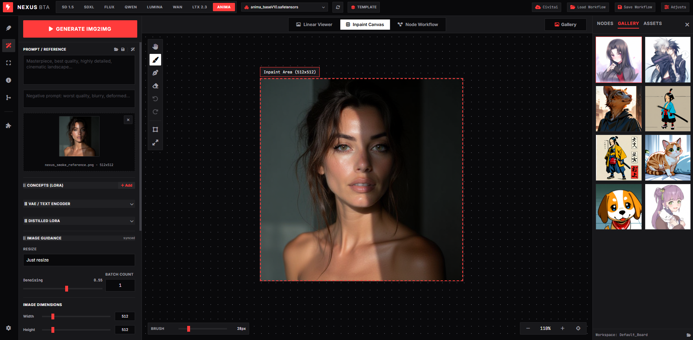
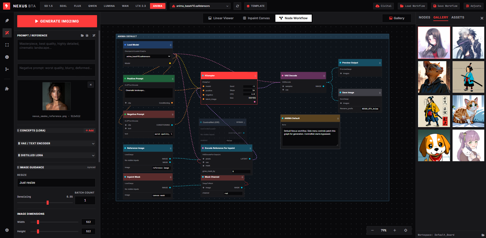
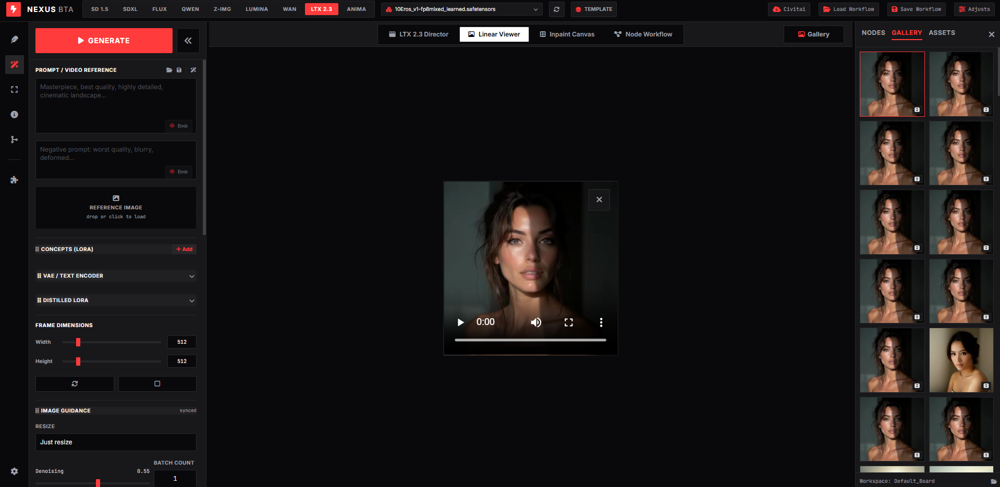
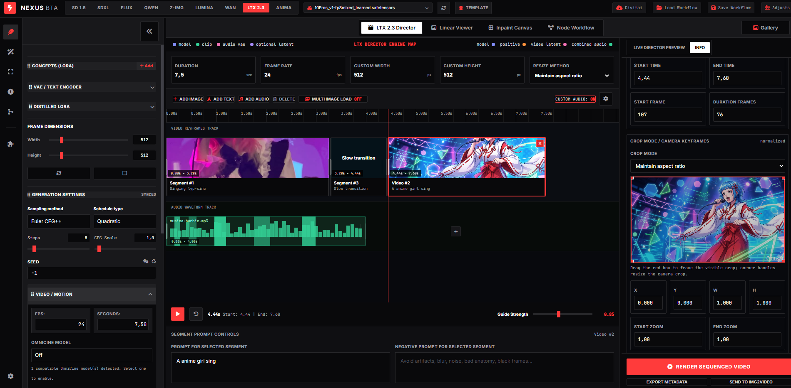
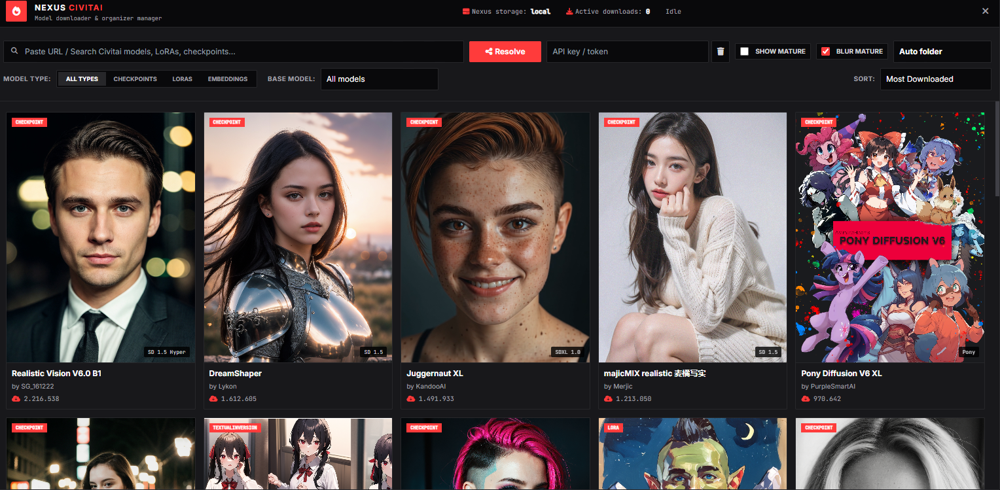
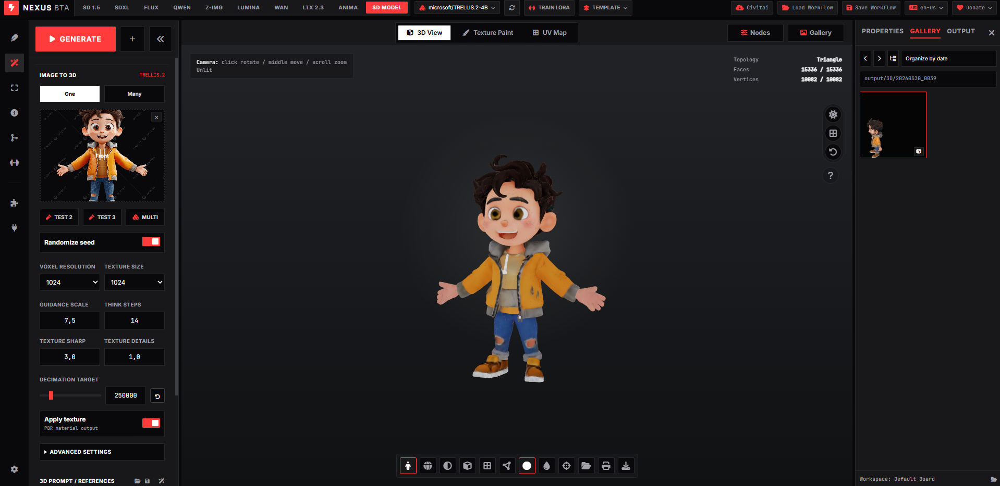

# Nexus BTA

[](https://ko-fi.com/jpandre)

Nexus BTA is a local AI image, video, workflow and 3D experiment studio built around an embedded ComfyUI runtime. It keeps the most common controls in one clean interface, while still letting advanced users inspect and edit the Comfy workflow graph.

If you are new here on Windows, start simple:

1. Run `run.bat`.
2. Open `http://127.0.0.1:7861/ui`.
3. Pick a model tab.
4. Write a prompt.
5. Click Generate.

Nexus supports SD 1.5, SDXL, Flux, Qwen, Z-Image Turbo, Lumina, WAN 2.2, LTX 2.3, Anima, LoRAs, ControlNet, inpaint, img2img, txt2img, video tools, workflow nodes, template customization and early 3D routes.

> **3D status:** the 3D workspace is still experimental. It works for testing TRELLIS/texture-paint routes, but it is not fully optimized yet and still has bugs. The next updates will continue improving 3D quality, preprocessing, cropping, background cleanup and stability.

## First Look

<video src="https://i.imgur.com/v9pnHrc.mp4" controls muted loop playsinline width="100%"></video>

The `examples/` folder includes quick visual references for the main workspaces.

<table>
  <tr>
    <td width="50%">
      
      <br><b>Main workspace</b><br>
      Pick a model, write prompts, generate, and browse outputs from one focused screen.
    </td>
    <td width="50%">
      
      <br><b>Nexus Customize</b><br>
      Save, load, reset or randomize UI themes, panel colors and template layout.
    </td>
  </tr>
  <tr>
    <td width="50%">
      
      <br><b>Inpaint canvas</b><br>
      Load a reference, paint masks, undo/redo edits, and send gallery images to the canvas.
    </td>
    <td width="50%">
      
      <br><b>Node Workflow</b><br>
      Inspect, move, pin, bypass and edit workflow nodes without leaving Nexus.
    </td>
  </tr>
  <tr>
    <td width="50%">
      
      <br><b>LTX 2.3 Linear View</b><br>
      Create short video routes with video VAE, audio VAE, distilled LoRAs and motion options.
    </td>
    <td width="50%">
      
      <br><b>LTX 2.3 Director</b><br>
      Build image, text, video and audio segments on a timeline, then export the joined result.
    </td>
  </tr>
  <tr>
    <td width="50%">
      
      <br><b>Civitai browser</b><br>
      Browse, download and organize models into the correct local Nexus folders.
    </td>
    <td width="50%">
      
      <br><b>3D workspace</b><br>
      Experimental image-to-3D and texture-paint route. It is useful for testing, but still has known bugs.
    </td>
  </tr>
</table>

## Why It Feels Fast

- One launcher on Windows: `run.bat` starts Nexus and the embedded ComfyUI runtime.
- Smart model folders: checkpoints, UNET/diffusion models, VAEs, text encoders, LoRAs, ControlNet, and video assets are discovered automatically.
- Template-aware side menu: preset changes keep workflow nodes, CFG, steps, resolution, video motion, LoRA stacks, and ControlNet in sync.
- LTX 2.3 Motion Transfer: Pose, Canny, Depth and Camera/Cameraman modes use IC-LoRA-compatible workflows with target identity conditioning, latent upscale x2, optional IC Detailer and Director segment rendering.
- Modern ControlNet routes: Flux, Qwen and Z-Image/ZImage presets expose compatible ControlNet model selection from the side menu and Civitai model browser.
- Inpaint workspace: LanPaint is the default inpaint template, Differential Diffusion remains selectable, and the canvas includes paint/remove masks, outpaint expand canvas, magic wand/select object, undo and redo.
- Extras video tools: video upscale can route through classic upscalers, FlashVSR-ready and SeedVR2-ready engines, LTX IC Detailer refine/upscale, interpolation, denoise, face restoration and MP4 encode.
- Template-scoped references: Qwen multi-reference image slots stay on Qwen, while SD/SDXL/Flux/Lumina/Anima/WAN/LTX return to their own img2img or img2video source controls.
- Clean gallery: final outputs refresh on launch, when the gallery opens, and after a new generation. Temporary Comfy previews are ignored.
- Organized outputs: image saves land under `output/image/`, normal video saves land under `output/video/`, Director joined videos land under `output/videos/`, and Director segment renders remain archived under `output/director/<date_time>/segments/`.
- Visual workflow view: inspect, link, multi-select, move and tune nodes without leaving the app; edited graphs are sent through the backend as Comfy workflow overrides.
- Civitai and Concept LoRA modals: browse, download, preview, multi-select, and route assets into the right local folders.
- Train LoRA workspace: prepare SD/SDXL/Flux/Qwen/WAN/LTX/Anima LoRA jobs, including LTX 2.3 Motion LoRA, Audio-Video LoRA and IC-LoRA plans with backend/Comfy route metadata.
- Template customization: save/load JSON templates, randomize modern color themes, customize side-menu panels, and keep pinned workflow nodes in sync.
- Experimental 3D workspace: test image-to-3D, texture paint and UV routes. This area is still being optimized and can contain bugs.

## Install

Nexus BTA is developed and smoke-tested primarily on Windows with an NVIDIA/CUDA runtime. Linux and macOS notes are included so the repo can be evaluated or adapted on those systems, but not every generation or training route has the same hardware support.

### Windows

Windows is the recommended path for this repo today.

If this is a fresh machine, bootstrap the runtime first:

```powershell
powershell -ExecutionPolicy Bypass -File scripts/bootstrap_nexus_runtime.ps1 -CopyPythonEnv
```

Then launch:

```bat
run.bat
```

Open:

```text
http://127.0.0.1:7861/ui
```

`run.bat`, `update.bat`, and the bootstrap script also check LTX Director dependencies. They install the WhatDreamsCost Director node, Kijai's Mel-Band RoFormer node, its Python requirements, the `MelBandRoformer_fp16.safetensors` model, and `ltx2.3-transition.safetensors` for LTX start/end transitions into the expected local folders when they are missing.

For the full LTX 2.3 video stack, use an NVIDIA GPU with CUDA. LTX's own open-source requirements list CUDA/NVIDIA-class hardware for local LTX 2.3 generation and training; the new Train LoRA UI can prepare LTX trainer jobs, but actual LTX LoRA/IC-LoRA training depends on the upstream LTX-2 trainer environment.

### Linux

Linux can run the backend and static UI manually. The Windows `.bat` and `.ps1` launchers now infer the project root from their own location, so they no longer depend on `D:\NexusBTA`, but they are still Windows launchers. On Linux, create the runtime yourself or use the Docker/RunPod path below:

```bash
python3.11 -m venv runtime/.venv
source runtime/.venv/bin/activate
python -m pip install --upgrade pip
python -m pip install -r requirements.txt
git clone https://github.com/comfyanonymous/ComfyUI.git runtime/ComfyUI
python -m pip install -r runtime/ComfyUI/requirements.txt
export NEXUS_BACKEND_HOST=127.0.0.1
export NEXUS_BACKEND_PORT=7861
python backend/run_backend.py
```

Open:

```text
http://127.0.0.1:7861/ui
```

Linux with an NVIDIA GPU and CUDA is the best non-Windows target for LTX 2.3 local generation, ComfyUI-LTXVideo routes and LTX-2 trainer jobs. Some Windows helper scripts for installing custom nodes still need to be translated to shell commands or handled through ComfyUI Manager.

### RunPod / Online Tunnel

For RunPod custom Docker builds, use the repository `Dockerfile` at the repo root and build context `.`. Nexus is validated against `torch 2.10.0+cu130`, so the default image is `pytorch/pytorch:2.10.0-cuda13.0-cudnn9-devel`. This keeps the Docker runtime aligned with the local Nexus dependency pins instead of downgrading to older RunPod templates.

RunPod templates such as `runpod/pytorch:1.0.3-cu1300-torch291-ubuntu2404` are closer than the PyTorch 2.1/2.8 public templates because they keep CUDA 13.0, but they still use Torch 2.9.1. Treat them as fallback/experimental only. If you use one through a custom build arg, keep Nexus from reinstalling PyTorch by filtering `torch`, `torchvision`, `torchaudio` and Windows-only xFormers wheels during install, as the Dockerfile does.

The Docker entrypoint starts Nexus on port `7861` and starts ComfyUI in the background through the backend. It does not start an external tunnel. On RunPod, expose HTTP port `7861` from the Pod template or use RunPod direct TCP. This keeps RunPod/Docker independent from Cloudflare, Gradio or ngrok.

For local sharing, use `StartLAN.bat` for direct LAN access with no intermediary. It binds Nexus to `0.0.0.0:7861` and prints local network URLs such as `http://192.168.x.x:7861/ui`. Use `StartTunnel.bat` only when the user explicitly wants a third-party tunnel; it asks the user to choose Tailscale Funnel, Cloudflare Quick Tunnel, ngrok or a custom command. If the selected tunnel client is missing, Nexus asks whether to install that optional dependency with `winget` before continuing.

### macOS

macOS support is partial. The legacy Nexus UI and backend can run, and ComfyUI officially supports Apple Silicon through PyTorch MPS, but the supported LTX 2.3 local video path is still CUDA/NVIDIA-focused. This is true even when you only want LTX 2.3 inference and do not need the LTX Trainer: LTX Desktop supports Apple Silicon Macs, but its current macOS generation path runs through the LTX API rather than local GPU inference. On Mac, expect SD/SDXL-style Comfy workflows to be the practical local target; use LTX API/LTX Desktop API mode or a remote CUDA machine for reliable LTX 2.3 video generation/training.

Apple Silicon setup:

```bash
python3.11 -m venv runtime/.venv
source runtime/.venv/bin/activate
python -m pip install --upgrade pip
pip install -r requirements.txt
git clone https://github.com/comfyanonymous/ComfyUI.git runtime/ComfyUI
pip install -r runtime/ComfyUI/requirements.txt
PYTORCH_ENABLE_MPS_FALLBACK=1 python backend/run_backend.py
```

Open:

```text
http://127.0.0.1:7861/ui
```

Mac compatibility notes:

- Apple Silicon/MPS can run many image workflows, but performance and custom-node coverage vary.
- Intel Mac is not a realistic target for local video generation.
- LTX 2.3 local generation without CUDA is not an officially supported Nexus target on macOS right now, even if you are not using the trainer. Experimental community MPS routes may appear, but expect broken custom nodes, black frames, missing kernels or CPU fallback until upstream LTX/Comfy dependencies support the exact route.
- LTX IC-LoRA workflows and LTX Trainer jobs should be treated as CUDA/NVIDIA-only locally.
- If `runtime/.venv/bin/python` is not picked up by your local settings, set `comfy_python` in `config/nexus_settings.json` to that path.

Reference notes checked while documenting macOS: ComfyUI Desktop for macOS supports Apple Silicon and recommends MPS; LTX's ComfyUI guide lists a CUDA-compatible GPU with 32GB+ VRAM for LTX-2 workflows; LTX Desktop's macOS generation currently runs through the LTX API instead of local GPU inference.

## Model Folders

Keep models under `models/`:

```text
models/checkpoints
models/unet
models/diffusion_models
models/loras
models/vae
models/text_encoders
models/controlnet
models/upscale_models
models/latent_upscale_models
models/frame_interpolation
models/background_removal
```

UNET-style models can live in either `models/unet` or `models/checkpoints`; Nexus resolves both.

## Model Assets

Use [requirements/model_assets.md](requirements/model_assets.md) as the friendly download map for base models, lightweight LoRAs, distilled LoRAs, LTX 2.3, WAN 2.2, Flux, Anima and textual inversion embeddings.

- LoRAs live in `models/loras` and can be grouped by family, such as `sd15`, `sdxl`, `flux`, `anima`, `wan` and `ltx`.
- Textual inversion files live in `models/embeddings`; the prompt Emb buttons insert them into positive or negative prompts for SD 1.5, SDXL, Pony and Illustrious routes.
- WAN 2.2 and LTX 2.3 use video-specific encoders, so use their model, VAE, text encoder and distilled LoRA assets instead of classic textual inversion. WAN 2.2 4-step runs need the matching high/low 4-step LoRA pair under `models/loras/wan`.
- LTX 2.3 assets are available from [Lightricks/LTX-2.3](https://huggingface.co/Lightricks/LTX-2.3); WAN 2.2 assets are available from [Wan-AI](https://huggingface.co/Wan-AI).
- LTX 2.3 latent upscale is part of the normal route. For a `512x512` output, Nexus samples the base latent at `256x256`, applies `LatentUpscaleModelLoader` + `LTXVLatentUpsampler` with `ltx-2.3-spatial-upscaler-x2-1.1.safetensors`, refines it, and then decodes the final video.
- LTX 2.3 start/end frame and transition-style txt2video/img2video use [joyfox/LTX-2.3-Transition-LORA](https://huggingface.co/joyfox/LTX-2.3-Transition-LORA) with trigger `zhuanchang`, installed under `models/loras/ltx_transition`.
- LTX 2.3 Motion Transfer uses IC-LoRA Union Control for Pose/Canny/Depth and the CameraMan IC-LoRA for camera motion transfer under `models/loras/ltx_ic`.
- LTX 2.3 Train LoRA uses the upstream [LTX-2 Trainer](https://github.com/Lightricks/LTX-2/tree/main/packages/ltx-trainer) for actual training. Nexus prepares local job configs for standard LTX LoRA, Motion LoRA, Audio-Video LoRA and IC-LoRA; running those jobs requires the upstream trainer environment and CUDA/NVIDIA hardware.
- Extras uses `models/upscale_models` for image/video raster upscalers, `models/video_restore_models` for FlashVSR/SeedVR2-style video restoration engines, `models/frame_interpolation` for RIFE/FILM frame interpolation, and `models/background_removal` for 2026 background-removal routes such as ComfyUI native BiRefNet. Alpha-aware video export is exposed as PNG sequence or MOV ProRes 4444.
- Remove BG expects `models/background_removal/birefnet.safetensors` for the native ComfyUI BiRefNet workflow. RMBG-2.0, InSPyReNet and BEN/BEN2 remain selectable compatibility routes when matching ComfyUI custom nodes are installed.

## Credits

- LTX 2.3 Director integration credits: [WhatDreamsCost/WhatDreamsCost-ComfyUI](https://github.com/WhatDreamsCost/WhatDreamsCost-ComfyUI).
- LTX 2.3 Transition LoRA credits: [joyfox/LTX-2.3-Transition-LORA](https://huggingface.co/joyfox/LTX-2.3-Transition-LORA).

## Output Layout

Generated media is grouped by type:

```text
output/image/YYYYMMDD_HHMMSS_<preset>_<activity>_...
output/video/YYYYMMDD_HHMMSS_<preset>_<activity>_...
output/videos/YYYYMMDD_HHMMSS_LTX_DIRECTOR_SEGMENTS_...   # Joined Director renders
output/director/YYYYMMDD_HHMMSS/segments/...              # Per-segment Director videos
output/extras/video/YYYYMMDD_HHMMSS/...   # Extras PNG sequences
```

Nexus applies this naming layer to default templates, loaded workflows and visual workflow overrides before sending the job to ComfyUI. Normal video generations stay in the `output/video` root. LTX Director segment renders are preserved in the Director archive and the joined timeline video is exported to `output/videos`. Extras video PNG sequence exports receive a per-run dated folder under `output/extras/video` so frame sequences do not mix with other runs. The Gallery can navigate output folders with visible folder cards, back/forward history, optional folder picker and date/type sorting.

## Verified Smoke Battery

Last verified on May 30, 2026:

- SD 1.5 and SDXL image generation, img2img, inpaint, and ControlNet Canny.
- Qwen, Flux and Z-Image/ZImage ControlNet routes at 512x512 with side-menu model selection.
- WAN 2.2 at 512x512, 2 seconds, 24 FPS.
- LTX 2.3 Linear View at 512x512/768x512, 24 FPS, 4 steps, CFG 1, with latent upscale x2, start/end frame, Transition LoRA, IC Detailer and Motion Transfer modes for Pose, Canny, Depth and Camera/Cameraman.
- LTX 2.3 Director Suite with Motion Transfer segments, non-motion segments, Transition LoRA end frames, CameraMan motion transfer, IC identity conditioning, per-segment outputs and joined final video export.
- Extras image upscale with Remacri/UltraSharp/RealESRGAN, RIFE `rife_v4.26`, video upscale, LTX IC Detailer refine/upscale, FlashVSR/SeedVR2-ready engines, denoise, face restoration, PNG sequence alpha and MOV ProRes 4444 alpha export.
- Extras Remove BG frontend plan sync with `models/background_removal/birefnet.safetensors`, recommended `Remove BG Image` and `Remove BG Video` presets, video PNG sequence or MOV ProRes 4444 alpha export, RGBA/mask output options and folder-aware Gallery navigation.
- Inpaint with LanPaint default workflow, Differential Diffusion option, paint/remove masks, generative outpaint canvas expansion, magic wand/select object and undo/redo.
- LTX 2.3 Director Suite with custom background audio, generated speech/ambience segments, per-segment negative prompts and non-black video output.
- Legacy Train LoRA front end across SD, SDXL, Illustrious, Pony, Flux, Flux 2, Flux 2 Klein, Qwen, WAN, LTX 2.3, Anima, Z-Image Turbo and Lumina templates, including LTX character/style/motion/audio-video/IC-LoRA job preparation with Launch disabled.
- Anima with Concept LoRA selection and gallery metadata.
- Node Workflow editor smoke: menu search, categorized add-node menu, visual multi-selection, grouped drag behavior, port connection/unlink affordances, and workflow override routing from the active graph.
- Nexus Customize smoke: theme save/load JSON, legacy template migration, randomize palettes, side-menu box colors, prompt text colors, Add LoRA modal theme, Civitai modal theme and pinned-node template state.
- 3D workspace smoke: TRELLIS/texture-paint UI, gallery routing and frontend status checks. 3D remains experimental and is not fully optimized yet.

## Notes

- Generated media stays in `output/image` and `output/video`.
- Temporary inputs, masks, Comfy previews, and Nexus temp files are cleaned after generation.
- Runtime files, model weights, generated media, and local settings are ignored by git.

## License

MIT. See [LICENSE](LICENSE).
